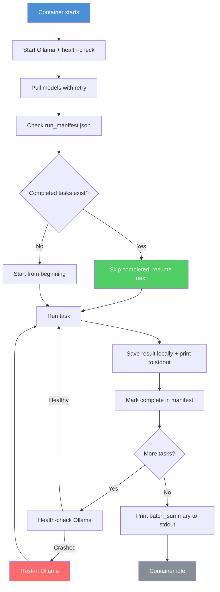

# LLM Evaluation — Project Report

## What We're Building

A system to **benchmark how much quality LLMs lose when quantized** (INT4, INT8 vs full FP32), across two task types:

| Script | What It Tests |
|--------|---------------|
| **Structured Output** | Can the model produce valid, schema-compliant JSON under pressure? (3 complexity levels) |
| **Long Context** | Can the model find and use information buried in long documents? (4K–32K tokens, needle-in-haystack) |

**Judge strategy:** Each quantized model is compared against the **FP32 version of itself** — giving a direct degradation score per quantization level.

---

## Architecture

```
run_eval.py (CLI entry point)
    ├── eval_structured_output.py    → Script 1
    ├── eval_long_context.py         → Script 2
    └── shared/
        ├── model_loader.py          → Ollama + HuggingFace (unified interface)
        ├── hardware_monitor.py      → GPU/VRAM/RAM sampling every 500ms
        ├── live_logger.py           → Structured JSON logs (stdout + file)
        ├── json_builder.py          → Result assembly + stdout output
        ├── metrics_aggregator.py    → p50/p95/p99 latency, error rates
        └── run_tracker.py           → Resume support for interrupted runs
```

**Backends supported:** Ollama (GGUF models) and HuggingFace Transformers (GPTQ, AWQ, bitsandbytes INT4/INT8, BF16/FP16).

---

## How It Works

### Script 1 — Structured Output

1. Load model → load schema (L1: flat/5 fields, L3: nested/15+ fields, L5: complex/conditional)
2. Prompt model to produce JSON matching the schema
3. Validate: parse → schema check → field completeness → type correctness
4. If parse fails: 1 retry with error injected into prompt
5. Compare output against FP32 reference → degradation score

### Script 2 — Long Context

1. Load model → load document (4K/8K/16K/32K tokens)
2. Inject a needle fact at 25%/50%/75%/90% depth
3. Ask model to find and use the fact, following system prompt rules
4. Compare output against FP32 reference → degradation score

---

## What Gets Measured

### Per Task

| Category | Metrics |
|----------|---------|
| **Quality** | `parse_success`, `schema_compliance`, `field_completeness`, `reference_match_rate`, `needle_found` |
| **Performance** | TTFT (ms), total latency (ms), tokens/sec, input/output token counts |
| **Hardware** | VRAM before/after/peak, GPU utilization (min/avg/max), GPU temp, RAM used |
| **Reliability** | `error_count`, `timeout_count`, `retry_count`, `tokens_wasted_on_retries` |

### Per Batch (Aggregate)

| Metric | Description |
|--------|-------------|
| **p50 / p95 / p99 latency** | Latency distribution across all tasks |
| **error_rate_percent** | % of tasks that failed |
| **avg tokens/request** | Average input + output tokens |
| **peak VRAM** | Maximum VRAM used across all tasks |

---

## Deployment on Salad Cloud

| Item | Detail |
|------|--------|
| **Packaging** | Docker image (CUDA 12.2 + Ollama + Python) ~5–8 GB |
| **GPU** | RTX 3090/4090 (24GB VRAM), selectable in Salad portal |
| **Models** | Pulled at runtime by Ollama (~5–10 min cold start) |
| **Result capture** | Printed to stdout with delimiter tags → visible in Salad portal logs |
| **Resume support** | `run_manifest.json` tracks completed tasks → skips on restart |
| **Ollama resilience** | Health-check before each task, auto-restart if crashed |
| **Cost** | ~$0.32 per full run (114 tasks) on RTX 4090 @ $0.19/hr |

### Salad Cloud Risks & Mitigations

| Risk | Mitigation |
|------|------------|
| Node interrupted mid-run | Resume from manifest; results already in stdout logs |
| Ollama crashes | Auto-restart via entrypoint health-check |
| OOM | Hardware monitor catches it; task skipped, not crashed |
| Model pull fails | 3 retries with backoff |

### Container Lifecycle Flow



---

## Test Matrix (Full Run)

```
2 models × 3 quant levels = 6 model variants

Script 1:  3 levels × 6 variants    =  18 runs
Script 2:  4 sizes × 4 depths × 6   =  96 runs
                              Total  = 114 runs
                         Est. time   = ~1.5 hours
                         Est. cost   = ~$0.32
```

---

## Output Format

Each task produces a JSON result with: `test_meta`, `model_config`, `hardware`, `input`, `output`, `quality_scores`, `performance`, `logs`, `task_specific`, `verdict`.

After the batch: `batch_summary.json` with aggregate stats (percentiles, error rates, token stats).

All results printed to stdout with `===RESULT_JSON_START===` / `===RESULT_JSON_END===` delimiters for easy extraction from Salad Cloud logs.

---

## Dependencies

| Package | Purpose |
|---------|---------|
| `transformers` | HuggingFace model loading |
| `auto-gptq` / `autoawq` / `bitsandbytes` | Quantization backends |
| `requests` | Ollama REST API |
| `jsonschema` | Structured output validation |
| `pynvml` / `psutil` | Hardware monitoring |
| `pyyaml` | Config files |